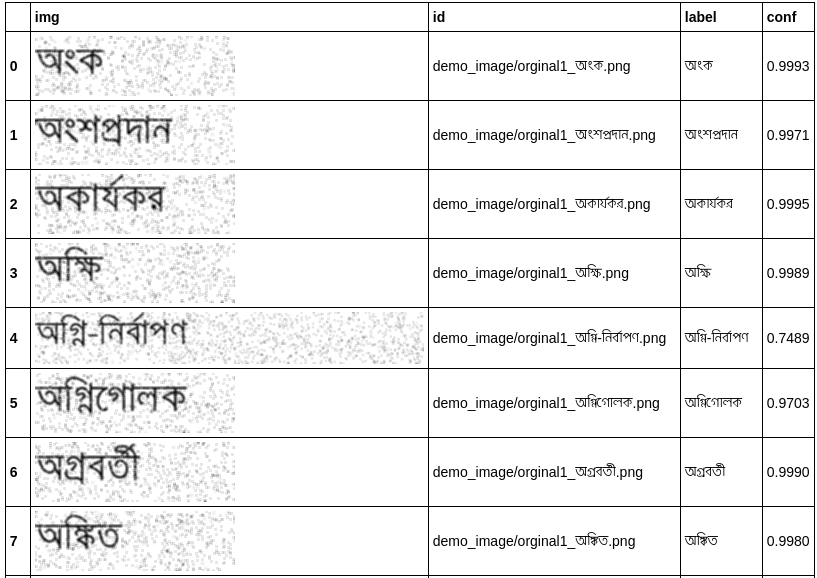
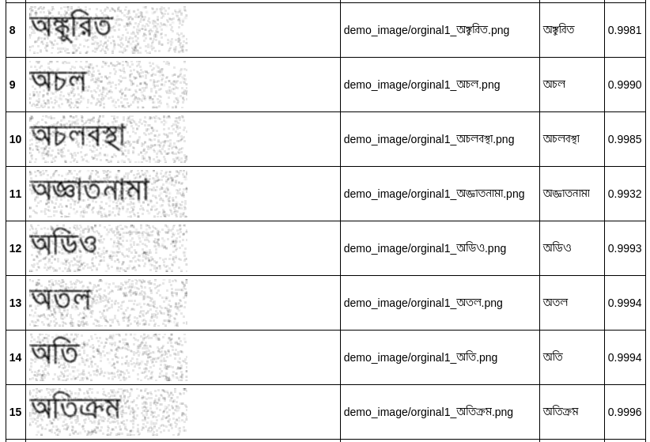
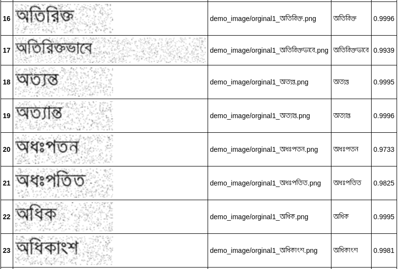
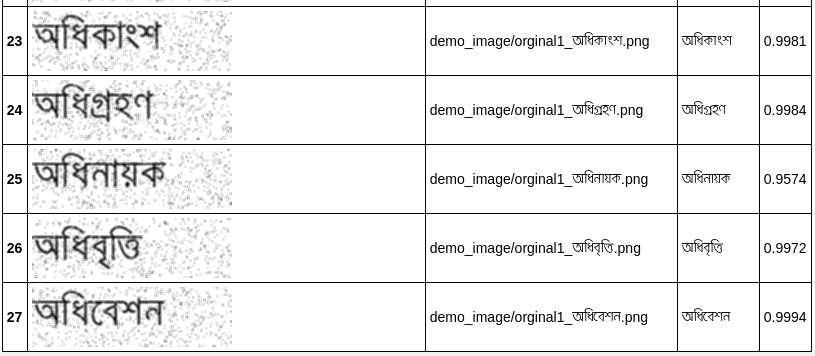

# Bangla Text Recognition
Bangla Text Recognition model is  four-stage STR framework, that most existing STR models fit into. Using this framework allows for the module-wise contributions to performance in terms of accuracy, speed, and memory demand, under one consistent set of training and evaluation datasets. Such analyses clean up the hindrance on the current comparisons to understand the performance gain of the existing modules. 


# Prepare dataset

At this time, gt.txt should be {imagepath}<space>{label}\n
For example
```
test/word_1.png saiful
test/word_2.png sungargonj
test/word_3.png moniram kazy
```

```pip install fire```

```
 python create_lmdb_dataset.py --inputPath dataset/train/img --gtFile dataset/train/gt.txt --outputPath mdb_dataset/train
```


# Training 
```
CUDA_VISIBLE_DEVICES=0 python train.py \
--train_data mdb_dataset/train --valid_data mdb_dataset/val \
--select_data / --batch_ratio 1 \
--Transformation TPS --FeatureExtraction ResNet --SequenceModeling BiLSTM --Prediction Attn
```


# Test Demo
```
CUDA_VISIBLE_DEVICES=0 python demo.py \
--Transformation TPS --FeatureExtraction ResNet --SequenceModeling BiLSTM --Prediction Attn \
--image_folder demo_image/ \
--saved_model bn_models/TPS-ResNet-BiLSTM-Attn.pth
```


## For cpu:
```
python demo.py \
--Transformation TPS --FeatureExtraction ResNet --SequenceModeling BiLSTM --Prediction Attn \
--image_folder demo_image/ \
--saved_model models/TPS-ResNet-BiLSTM-Attn.pth
```
# Screenshot




